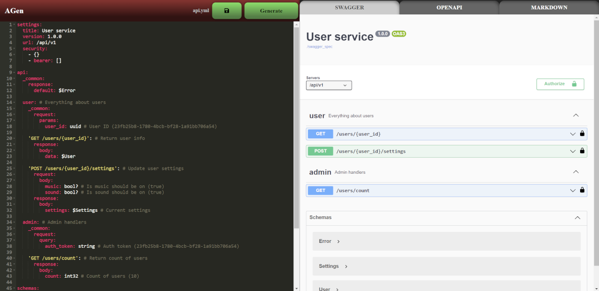

AGen is a tool that allows you to generate an OpenAPI specification, Swagger documentation and a service framework using [ogen](https://github.com/ogen-go/ogen) and [sqlc](https://github.com/sqlc-dev/sqlc) from a YML file with a lightweight API description.

### Installation
To install agen tool use `go install` command:
```
go install github.com/Kegian/agen/cmd/agen@latest
```

### Project initialization
To generate template service, type:
```
agen init example.com/project
```
This will generate structured project, which have:
- Base project files as an example
- `Makefile` with basic commands
- `Dockerfile` and `docker-compose.yml` files for building docker image
- `migrations/` folder, containing migration files for Postgres and ClickHouse
- `sqlc.yaml` file and `query/`for working with Postgres

### Golang import

AGen provide some tools to work with databases, configs, sentry, etc. To use agen as a library, import it with:
```
import "github.com/Kegian/agen"
```

### Generating OpenAPI/ogen files

To generate OpenAPI and ogen files from AGen YML file, use:
```
agen gen -i <path/to/agen.yml> -o <path/to/output/folder> [-t <all/oapi/ogen>]
```

### AGen API Format

The API format is described in a yml file (e.g., api.yml) and is used to generate an OpenAPI 3.0.2 specification file, which is necessary for generating swagger documentation and \*.go server files ([ogen](https://github.com/ogen-go/ogen)) generation.

The API allows accepting parameters in headers, query, path, and body params, and returning a response in the body. The format for the request and response body is JSON (application/json) for text and binary (application/octet-stream) for a file.

#### File structure

API file have 3 main sections:

|Section|Description|
|--|--|
|**settings**|Main settings of the server (e.g., name, version, base path)|
|**api**|Server API method declarations|
|**schemas**|Server API custom scheme declarations|

##### Settings section
|Field|Description|
|--|--|
|**title**|Service title|
|**version**|API version|
|**url**|Base API URL|
|**security**|OpenAPI security section|

<details> 
  <summary>Example</summary>
  
  ```yml
  settings:
    title: User service
    version: 1.0.0
    url: /api/v1
    security:
      - {}
      - bearer: []
   ```
</details>

##### API section

This section describes the specification of server methods. Methods are grouped by tags. Common parts of requests and responses can be moved to the `_common` section.

```yml
api:
  _common: # Common section applicable to all methods
    request: ...
    response: ...

  tag1: # Grouping methods by a tag

    'GET /users/{user_id}': # GET method (e.g, `/users/1`)
    
      request: # Section defining the request
        query: # Query parameters of the request
          param1: int32 # Query parameter `param1`
        headers: # Header parameters of the request
          some-header: string # Header parameter `Some-Header`
        params: # Path parameters of the request
          user_id: int64 # Integer parameter user_id
        body: # Body json request (e.g., `{"flag": true}`)
          flag: bool # Boolean field `flag` ot the json body
          
      response: # Section defining the response
        body: # Body json response
          data: $User # Field of the response with custom type `User` ("data": <type User>)
        
        403: ... # Response on the 403 http error
        404: ... # Response on the 404 http error
        default: ... # Default response on an error

  tag2:
  
    _common: # Common section applicable to methods inside this tag
      request: ...
      response:
        default: $Error # Using custom `Error` type as default response

    'POST /images/{file_name:string}/rotate': # POST method, path parameter typed inline
      name: RotateImage # OpenAPI operation id
      request:
        query:
          angle: int32
        body: file # Transferring a file in the request
      response:
        body: file # Returning a file in the response
```

##### Schemas section

This section describes user-defined types. Types can inherit fields from other types.

```yml
schemas:
  
  User: # Custom user type of type object
    id: int64 # ID field of type int64
    name: string # Name field of type string
    images: $Image[] # Field images, array of Image objects
    last_login: $UnixTime # Field of custom type UnixTime (int64)

  UnixTime: int64 # Custom type UnixTime of type int64

  Image: # Custom type Image
    title: string? # Optional field title of type string
    size: # Field size of type object
      height: int32
      width: int32
  
  ImageFull<$Image>: # Custom type ImageFull which inherits fields from type Image (title, size)
    views: int32
    likes: int32
    liked_by: $User[]? # Optional field liked_by of array type User
```

<details> 
  <summary>Type inheritance</summary>
  
  ```yml
  TypeA:
    a: int32
  TypeB:
    b: int32
  TypeC:
    c: int32
  
  CommonType<$TypeA,$TypeB,$TypeC>:
    c: string
    d: bool
   ```

 Result CommonType equivalent to:
   ```yml
  CommonType:
    a: int32
    b: int32
    c: string
    d: bool
   ```
</details>

###### Base data types

|Type name|OpenAPI 3.0 type|Description|
|--|--|--|
|**any**|{}|Any value type|
|**bool**|boolean|Boolean type|
|**int32**|integer($int32)|32-bit integer type|
|**int64**|integer($int64)|64-bit integer type|
|**float32**, **float**|number($float)|32-bit float type|
|**float64**, **double**|number($double)|64-bit float type|
|**string**|string|String type|
|**uuid**|string($uuid)|UUID-format string type|
|**file**|string($binary)|Binary-format string type|
|*\<type\>***[]**|array(*\<type\>*)|Array of the elements|
|*\<type\>***?**|*not in required*|Non-required parameter|
|**$***\<name\>*|$ref: '#/components/schemas/*\<name\>*'|Custom type|

###### Descriptions and examples:

A description can be specified for tags, methods, fields and types. An example can also be specified for fields. The description is specified in the comments on the same line. The example is specified in brackets after the description.

```yml
api:
  tag1: # <tag description>
    'GET /method': # <method description>
      request:
        query:
           field: int32 # <field description> (<field example>)
...

schemas:
  Type: # <type description>
    field: int32 # <field description> (<field example>)  
```

#### Example

An example of api.yml file:

```yml
settings:
  title: User service
  version: 1.0.0
  url: /api/v1
  security:
    - {}
    - bearer: []

api:
  _common:
    response:
      default: $Error

  user: # Everything about users
    _common:
      request:
        params:
          user_id: uuid # User ID (23fb25b8-1780-4bcb-bf28-1a91bb706a54)

    'GET /users/{user_id}': # Return user info
      response:
        body:
          data: $User

    'POST /users/{user_id}/settings': # Update user settings
      request:
        body:
          music: bool? # Is music should be on (true)
          sound: bool? # Is sound should be on (true)
      response:
        body:
          settings: $Settings # Current settings

  admin: # Admin handlers
    _common:
      request:
        query:
          auth_token: string # Auth token (23fb25b8-1780-4bcb-bf28-1a91bb706a54)

    'GET /users/count': # Return count of users
      response:
        body:
          count: int32 # Count of users (10)

schemas:
  Error:
    code: int64 # Error code
    message: string # Error message
    debug: string? # Debug message

  User:
    id: uuid # (23fb25b8-1780-4bcb-bf28-1a91bb706a54)
    name: string
    settigs: $Settings
  
  Settings:
    music: bool # Is music on (true)
    sound: bool # Is sound on (true)
```

<details> 
<summary>Сorresponding generated OpenAPI YML file</summary>
  
```yml
openapi: 3.0.2
info:
  title: User service
  version: 1.0.0
servers:
- url: /api/v1
security:
- {}
- bearerAuth: []
tags:
- description: Everything about users
  name: user
- description: Admin handlers
  name: admin
paths:
  /users/{user_id}:
    get:
      description: Return user info
      operationId: Users
      parameters:
      - description: User ID
        in: path
        name: user_id
        required: true
        schema:
          description: User ID
          example: 23fb25b8-1780-4bcb-bf28-1a91bb706a54
          type: string
      responses:
        "200":
          content:
            application/json:
              schema:
                properties:
                  data:
                    $ref: '#/components/schemas/User'
                required:
                - data
                type: object
          description: Successful operation
        default:
          content:
            application/json:
              schema:
                $ref: '#/components/schemas/Error'
          description: Default response
      tags:
      - user
  /users/{user_id}/settings:
    post:
      description: Update user settings
      operationId: UsersSettings
      parameters:
      - description: User ID
        in: path
        name: user_id
        required: true
        schema:
          description: User ID
          example: 23fb25b8-1780-4bcb-bf28-1a91bb706a54
          type: string
      requestBody:
        content:
          application/json:
            schema:
              properties:
                music:
                  description: Is music should be on
                  example: "true"
                  type: boolean
                sound:
                  description: Is sound should be on
                  example: "true"
                  type: boolean
              type: object
        required: true
      responses:
        "200":
          content:
            application/json:
              schema:
                properties:
                  settings:
                    $ref: '#/components/schemas/Settings'
                required:
                - settings
                type: object
          description: Successful operation
        default:
          content:
            application/json:
              schema:
                $ref: '#/components/schemas/Error'
          description: Default response
      tags:
      - user
  /users/count:
    get:
      description: Return count of users
      operationId: UsersCount
      parameters:
      - description: Auth token
        in: query
        name: auth_token
        required: true
        schema:
          description: Auth token
          example: 23fb25b8-1780-4bcb-bf28-1a91bb706a54
          type: string
      responses:
        "200":
          content:
            application/json:
              schema:
                properties:
                  count:
                    description: Count of users
                    example: "10"
                    format: int32
                    type: integer
                required:
                - count
                type: object
          description: Successful operation
        default:
          content:
            application/json:
              schema:
                $ref: '#/components/schemas/Error'
          description: Default response
      tags:
      - admin
components:
  schemas:
    Error:
      properties:
        code:
          description: Error code
          format: int64
          type: integer
        debug:
          description: Debug message
          type: string
        message:
          description: Error message
          type: string
      required:
      - code
      - message
      type: object
    Settings:
      properties:
        music:
          description: Is music on
          example: "true"
          type: boolean
        sound:
          description: Is sound on
          example: "true"
          type: boolean
      required:
      - music
      - sound
      type: object
    User:
      properties:
        id:
          example: 23fb25b8-1780-4bcb-bf28-1a91bb706a54
          format: uuid
          type: string
        name:
          type: string
        settigs:
          $ref: '#/components/schemas/Settings'
      required:
      - id
      - name
      - settigs
      type: object
  securitySchemes:
    bearerAuth:
      scheme: bearer
      type: http
```
</details>

### Web editor

This tool also allows you to edit the API file in a web editor with the ability to view the generated OpenAPI specification, Swagger and Markdown description.

To run web editor, type:
```bash
agen web
```

To edit existing file, type:
```bash
agen web <path/to/file>
```


